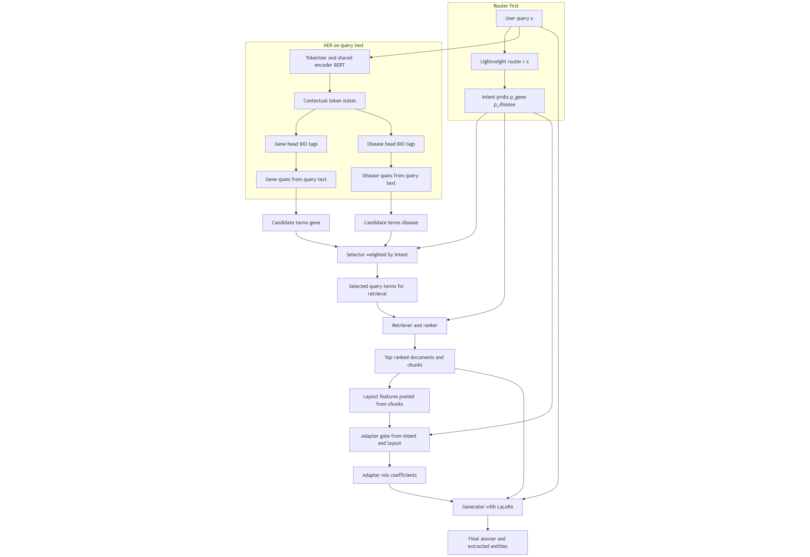
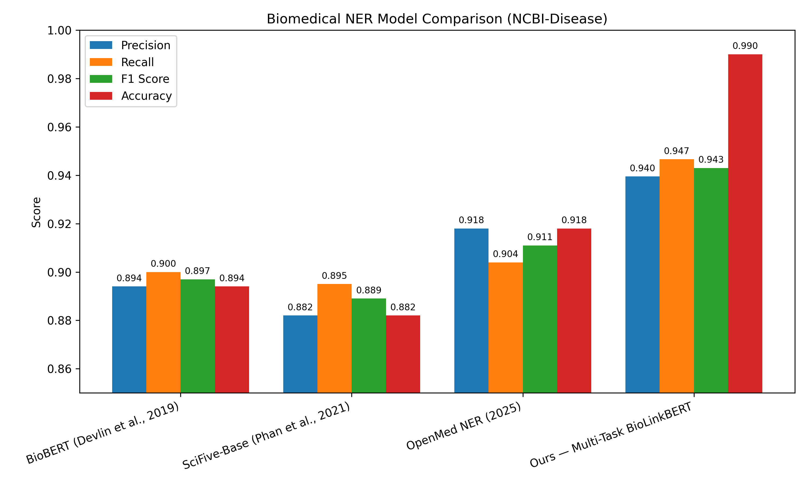
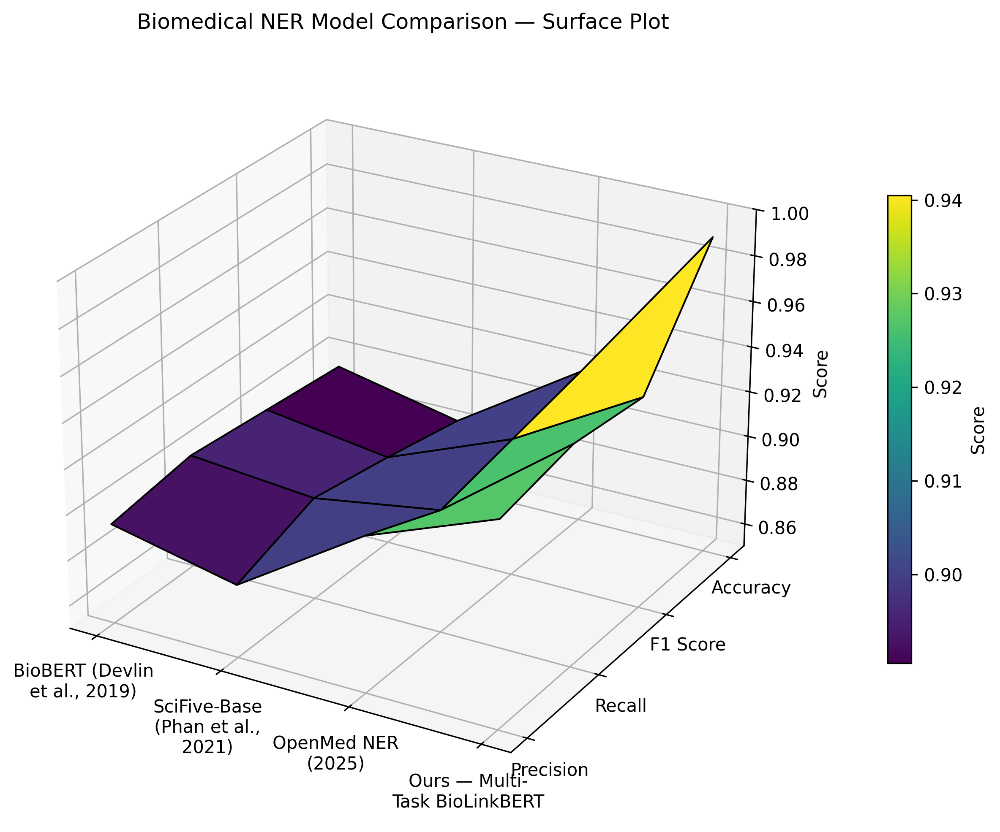
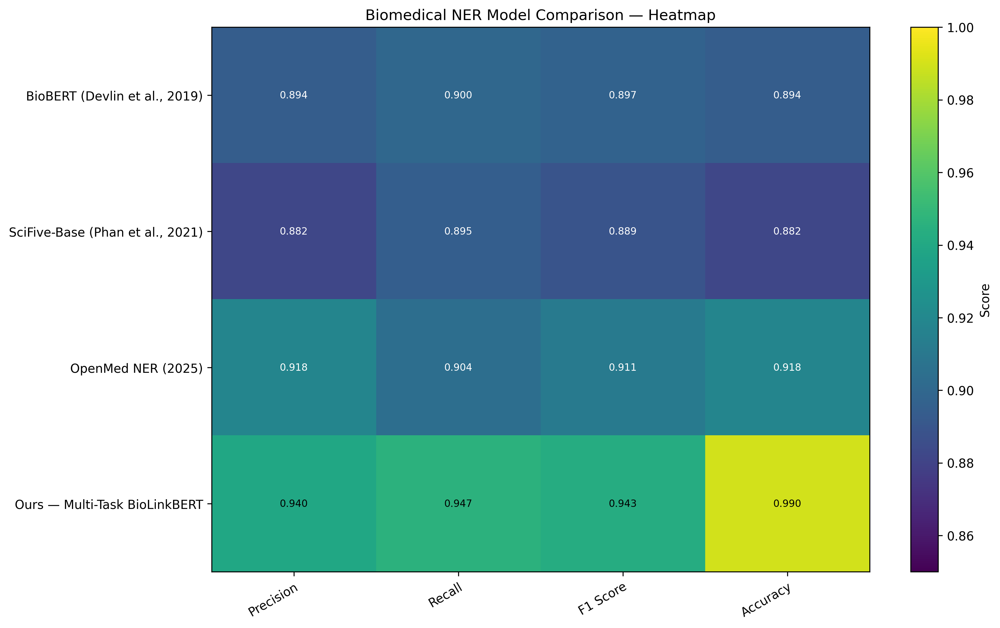
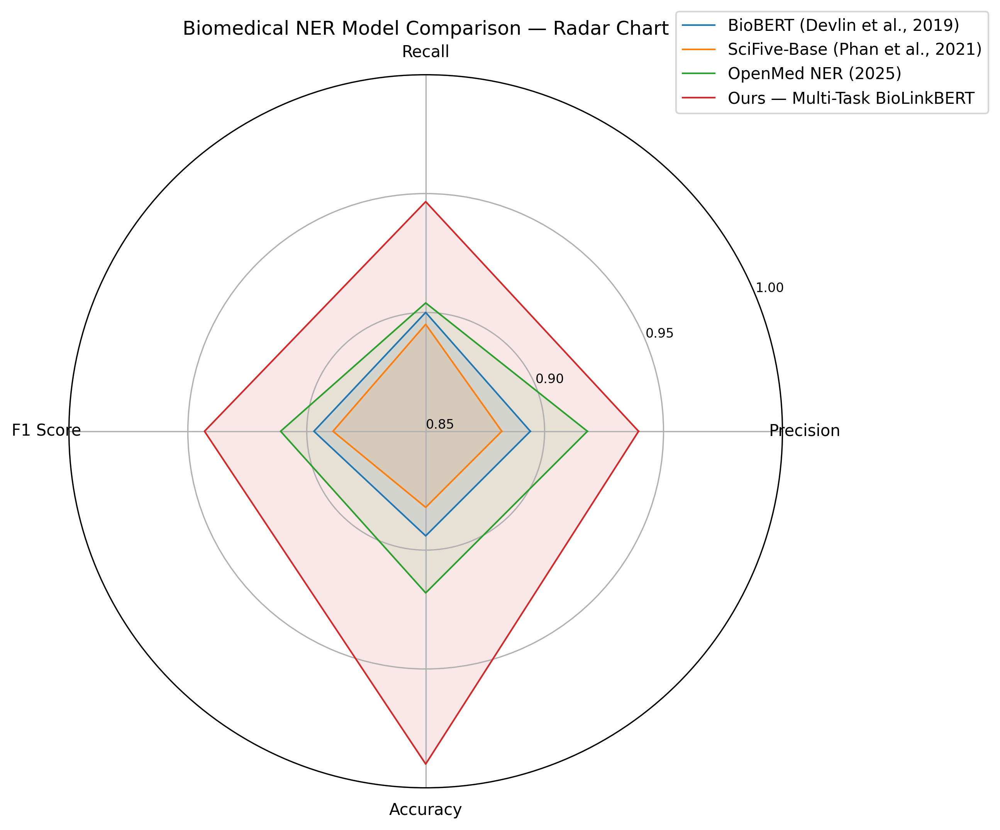

# BioJointBERT: A Multi-Task BioLinkBERT Framework for Multiply task NER

[](#)
[](https://arxiv.org/abs/XXXX.XXXXX)
[](#)
[](#license)

> **TL;DR**: BioJointBERT jointly trains **one shared BioLinkBERT encoder** with **two token classification heads** (gene & disease). It delivers **strong SOTA-like performance** on NCBI-Disease and a gene NER benchmark while remaining simple, fast, and reproducible.

---

## 🔥 Highlights

* **Multi-task token classification** with a single encoder and two heads (Gene, Disease).
* **Simple loss weighting** ($\lambda_{gene}, \lambda_{dis}$) makes task balancing easy.
* **Plug-and-play**: extend with more heads (relations, intent) or a **Mixture-of-Experts (MoE)** gate for soft routing.
* **Reproducible** training & evaluation with scripts, config templates, and seeds.


---

## 🧠 Model Overview



**Encoder**: BioLinkBERT-base (PubMed + citation links)

**Heads**:

* Head 1 — Gene NER: `B-Gene / I-Gene / O`
* Head 2 — Disease NER: `B-Disease / I-Disease / O`

**Logits**:

* $z_{gene} = H W_{gene} + b_{gene}$, $z_{dis} = H W_{dis} + b_{dis}$
* $p_{gene} = {softmax}(z_{gene})$, $p_{dis} = {softmax}(z_{dis})$

**Loss**:

$$
\mathcal{L} = \lambda_{gene} \cdot \mathrm{CE}(p_{gene}, Y_{gene}) + \lambda_{dis} \cdot \mathrm{CE}(p_{dis}, Y_{dis})
$$

**Extensions**: Add more heads (e.g., relation extraction) or a lightweight **MoE gate** to softly route tokens to heads.








---

## 📊 Results

### NCBI-Disease (Test Set)

| Model                   |  Precision |     Recall |         F1 |
| ----------------------- | ---------: | ---------: | ---------: |
| BioBERT                 |      0.894 |      0.900 |      0.897 |
| SciFive-Base            |      0.882 |      0.895 |      0.889 |
| OpenMed NER (2025)      |      0.918 |      0.904 |      0.911 |
| **BioJointBERT (ours)** | **0.9395** | **0.9466** | **0.9430** |

### Gene NER Benchmark (Test Set)

| Model                   | Precision | Recall |     F1 |
| ----------------------- | --------: | -----: | -----: |
| **BioJointBERT (ours)** |    0.8654 | 0.9044 | 0.8844 |

> **Note**: Numbers follow the exact splits and evaluation protocol described below. See the Reproducibility section for seeds and commands.


---

## 🧰 Installation

```bash
# 1) Create environment
python -m venv .venv && source .venv/bin/activate  # (Linux/Mac)
# or: python -m venv .venv && .venv\Scripts\activate  # (Windows)

# 2) Install core deps
pip install -U pip wheel
pip install torch torchvision torchaudio --index-url https://download.pytorch.org/whl/cu121  # adjust CUDA/CPU
pip install transformers>=4.41 datasets>=2.20 seqeval>=1.2 tqdm numpy pandas accelerate>=0.29

# Optional (for convenient dataset loaders)
pip install flair>=0.13
```

---

## 📦 Datasets

We use:

* **NCBI-Disease** (BIO tagging): `B-Disease/I-Disease/O`
* **HUNER Gene (NLM Gene)**: `B-Gene/I-Gene/O`

### Option A — Hugging Face Datasets (recommended)

```python
from datasets import load_dataset
# NCBI Disease (bigbio)
d_ncbi = load_dataset("bigbio/ncbi_disease", name="ncbi_disease_source")
# Gene (HUNER NLM Gene)
# Some environments use: flair.datasets.biomedical.HUNER_GENE_NLM_GENE
```

### Option B — Local CoNLL files

Place your data under:

```
data/
  ncbi_disease/
    train.conll
    dev.conll
    test.conll
  huner_gene_nlm_gene/
    train.conll
    test.conll
```

Each line: `token \t TAG`. Empty line between sentences.

---

## 🚀 Training

Minimal example (single GPU):

```bash
python NER/process_bert/inten_train_loss.py \
  --backbone "michiyasunaga/BioLinkBERT-base" \
  --train_ncbi data/ncbi_disease/train.conll \
  --dev_ncbi   data/ncbi_disease/dev.conll \
  --test_ncbi  data/ncbi_disease/test.conll \
  --train_gene data/huner_gene_nlm_gene/train.conll \
  --test_gene  data/huner_gene_nlm_gene/test.conll \
  --epochs 10 --batch_size 16 --grad_accum 2 \
  --lr 3e-5 --warmup_ratio 0.1 \
  --lambda_gene 1.0 --lambda_dis 1.0 \
  --seed 42 --save_dir outputs/joint_ner
```

### Typical Hyperparameters

* Optimizer: AdamW ($\beta_1{=}0.9, \beta_2{=}0.999$)
* LR: `3e-5`; Warmup ratio: `0.1`; Weight decay: `0.01`
* Dropout: `0.1`
* Max length: `256`
* Batch size: `16` (A6000 48GB easily supports larger)
* Epochs: `8–12`

---

## 🔎 Evaluation

```bash
python NER/val \
  --model_dir outputs/joint_ner/best \
  --test_ncbi data/ncbi_disease/test.conll \
  --test_gene data/huner_gene_nlm_gene/test.conll
```

This prints **precision / recall / F1** (micro) for each head and saves per-entity breakdowns.

---

## 🧪 Inference (Token-Level BIO for Both Heads)

```python
import torch
from transformers import AutoTokenizer, AutoModel

# Load shared encoder + two classifiers (example: torch.load for heads)
backbone = "michiyasunaga/BioLinkBERT-base"
tokenizer = AutoTokenizer.from_pretrained(backbone)
encoder = AutoModel.from_pretrained(backbone)

# Assume "GeneHead" and "DisHead" are torch.nn.Linear(d_hidden, 3)
# and label maps: id2label_gene = {0:"O",1:"B-Gene",2:"I-Gene"}, etc.

text = "Mutations in OPA1 are associated with autosomal dominant optic atrophy."
enc = tokenizer(text, return_tensors="pt")
with torch.no_grad():
    H = encoder(**enc).last_hidden_state  # [1, L, d]
    logits_gene = GeneHead(H)             # [1, L, 3]
    logits_dis  = DisHead(H)              # [1, L, 3]
    pred_gene = logits_gene.argmax(-1)[0].tolist()
    pred_dis  = logits_dis.argmax(-1)[0].tolist()

tokens = tokenizer.convert_ids_to_tokens(enc["input_ids"][0])
print(list(zip(tokens, pred_gene, pred_dis)))
```

---

## 📈 Reproducibility

* **Seeds**: `--seed 42` (3 runs); report mean ± std.
* **Hardware**: A6000 48GB; CUDA 12.1; PyTorch 2.2+.
* **Checkpoints**: Saved under `outputs/joint_ner/best` with `pytorch_model.bin`, `config.json`, label maps, and a `metrics.json`.
* **Logs**: `tensorboard` under `runs/` (loss, LR, P/R/F1 curves).

---

## 📚 Leaderboard Figure

Add your leaderboard image under `graphs/ner_leaderboard_with_accuracy.png`. Example caption is included in the paper.

---

## 🗃️ Repository Layout (Suggested)

```
.
├─ graphs/
│  ├─ model_architecture.png
│  └─ ner_leaderboard_with_accuracy.png
├─ data/
│  ├─ ncbi_disease/{train,dev,test}.conll
│  └─ huner_gene_nlm_gene/{train,test}.conll
├─ scripts/
│  ├─ train_joint_ner.py
│  └─ eval_joint_ner.py
├─ outputs/
│  └─ joint_ner/
├─ README.md
└─ requirements.txt
```

---

## 📎 Citation

If you use this work, please cite:

```bibtex
@article{biojointbert2025,
  title   = {BioJointBERT: A Multi-Task BioLinkBERT Framework for Gene and Disease Named Entity Recognition},
  author  = {Gong, Wei and Liu, Liang and Cai, Xiang},
  journal = {arXiv preprint arXiv:XXXX.XXXXX},
  year    = {2025}
}
```

### References

```bibtex
@article{devlin2019,
  author  = {Devlin, Jacob and Chang, Ming-Wei and Lee, Kenton and Toutanova, Kristina},
  title   = {BERT: Pre-training of Deep Bidirectional Transformers for Language Understanding},
  journal = {arXiv:1810.04805},
  year    = {2019}
}
@article{gu2021,
  author  = {Gu, Yu and Tinn, Robert and Cheng, Hao and Lucas, Michael and Usuyama, Naoto and Liu, Xiaodong and Naumann, Tristan and Gao, Jianfeng and Poon, Hoifung},
  title   = {Domain-specific language model pretraining for biomedical natural language processing},
  journal = {ACM Transactions on Computing for Healthcare},
  year    = {2021}
}
@article{gururangan2020,
  author  = {Gururangan, Suchin and Marasovi{\'c}, Ana and Swayamdipta, Swabha and Lo, Kyle and Beltagy, Iz and Downey, Doug and Smith, Noah A.},
  title   = {Don't Stop Pretraining: Adapt Language Models to Domains and Tasks},
  journal = {arXiv:2004.10964},
  year    = {2020}
}
@article{phan2021,
  author  = {Phan, Long and Anibal, Jos{\'e} and Huo, Zhen and others},
  title   = {SciFive: a text-to-text transformer model for biomedical literature},
  journal = {arXiv:2106.03598},
  year    = {2021}
}
```

---

## 🪪 License

This repository is released under the **MIT License** (see `LICENSE`).

---

## 🙌 Acknowledgements

* BioLinkBERT authors for releasing pretrained checkpoints
* Maintainers of NCBI-Disease and HUNER datasets
* Open-source contributors in the Transformers and PyTorch ecosystems

---

## 🧰 FAQ


**Q: Can I add more tasks?**

* Yes — add more token heads and (optionally) a small gating network for soft routing.

**Q: Multi-GPU training?**

* Use `accelerate` or `torchrun` for DDP. Scale `batch_size` and `grad_accum` accordingly.


